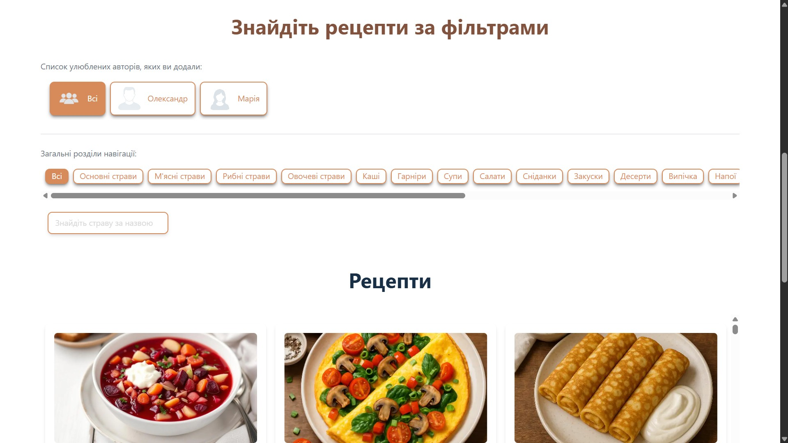

# 🍲 Culinary Corner
## A web application for saving, editing, and managing culinary recipes.

> ⚠️ For security reasons, administrator confidential data, database access keys, and other secrets have been removed for demonstration purposes.

---

## Live site
Working web application: [Go to the website](https://kulinarny-kutochok.com.ua/)

---

## Features
- Registration, email verification, and authentication
- Data protection using JWT
- Real-time field validation and forbidden word checks
- Recipe filtering by categories, favorite authors, and keywords
- Responsive design for mobile and desktop

### After authentication, a user can:
- Add recipes
- Add authors and recipes to favorites
- Leave reviews and comments on other users' recipes

### User Profile
- View, edit, and delete their own recipes
- View notifications about comments on their recipes
- View favorite recipes and authors
- Subscribe to new recipes via email
- Delete all personal data

### Automations
- Checking and cleaning expired user accounts
- Cleaning expired or blocked emails
- Sending new recipes to subscribers on schedule
- Automatic sitemap generation
- Automatic image optimization and conversion
- Temporary login blocking after multiple failed attempts (brute-force protection)

### Admin Panel
- Recipes — manage, edit, and delete user-submitted recipes
- Comments — moderate user comments on recipes
- Users — view user data, block or delete users along with all their content

### SEO
- Dynamic generation of meta tags (title, description) for each recipe
- Open Graph and Twitter Cards for social networks
- Canonical URL and meta robots for proper indexing
- Sitemap for search engines (automatically updated)
---

## Technologies
### Frontend
- Vue 3
- TypeScript
- Tailwind CSS
- Vite
- Pinia (state management)
- Vue Router
- VueUse Head
- Vee-Validate + Yup (for validation)
- Vue Virtual Scroll Grid (to optimize rendering of many recipes without performance drops)
- Prettier & ESLint (formatting and linting)

### Backend
- Node.js
- Express
- MongoDB + Mongoose
- TypeScript
- JWT (authentication)
- Bcrypt (password hashing)
- Multer (file uploads)
- Sharp (image processing)
- Nodemailer (sending emails)
- Node-cron (scheduled tasks)
- Winston + Winston Daily Rotate File (logging requests and errors for monitoring and debugging)
- dotenv (environment configuration)

---

## Screenshots

    

        
        
    

    

        
        
    

    

        
        
    

---

## ⚠️ License / Usage
>This repository contains a **public demo version** of the Culinary Corner project for **portfolio and educational purposes only**.  

❌ **You are not allowed to copy, redistribute, modify, or use this code for commercial or personal projects**.  

For full functionality, visit the live site: [https://kulinarny-kutochok.com.ua](https://kulinarny-kutochok.com.ua)